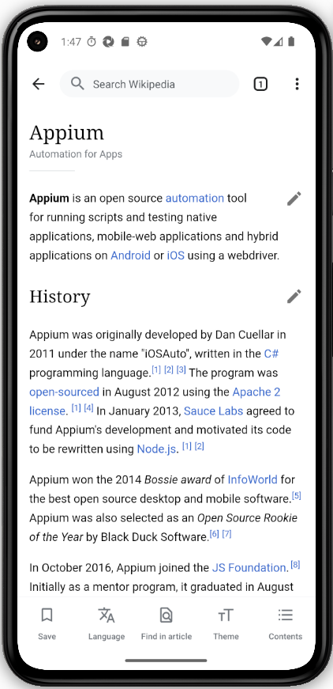
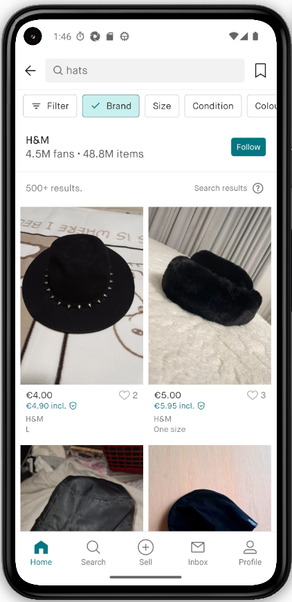

# Appium Java simple project
## Description
- Appium
- Selenium
- Java
- Gradle
- TestNG

## Implemented
- Wikipedia app tests (Android)
- Vinted app tests (Android)
- Re-running tests when a fall occurs

### 1. Wikipedia app
[](readme-assets/wikipedia.png)

### 2. Vinted app
Precondition:
- The app is installed on the mobile device
- An account has been created
- The user is logged into the application

[](readme-assets/vinted.png)

## Run tests
Wikipedia all tests:
```
./gradlew clean test -PwikipediaTest
```
Wikipedia single test:
```
./gradlew clean test -PwikipediaSingleTest
```
Vinted test:
```
./gradlew clean test -PvintedTest
```

Before running the tests, it is necessary to uncomment the lines (`app.package`, `app.activity`, `app.path`) 
in the file `src/main/resources/test.properties`, depending on the application being launched.